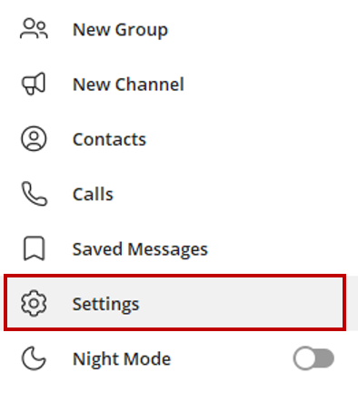
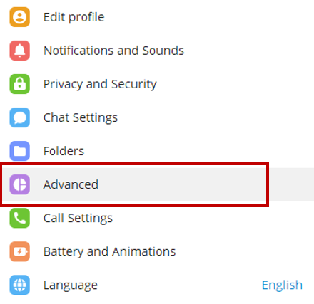
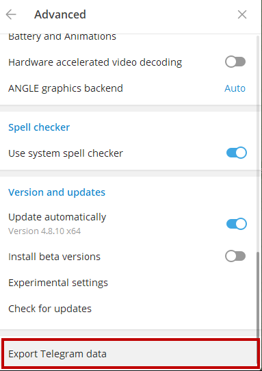
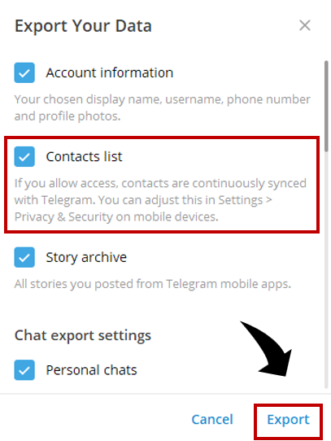

# TelegramContract2vCard
## make telegram contacts to 2vCard
### install
```sh
pip install TelegramContract2vCard
```
### Usage
1. Export your telegram contacts to `contacts.html` or `result.json`(download step is below)
2. Put `contacts.html` or `result.json` in the same directory as this script
3. Run this script
```py
from TelegramContract2vCard import html2vcard, json2vcard, html2dict, json2dict, dict2vcard
```
```py
# make html or json to vcard
html2vcard('contacts.html')
json2vcard('result.json')

# you can also make html or json to vcard with custom name and custom path
html2vcard('contacts.html', 'custom_name', 'your/path/to/save/vcard')
json2vcard('result.json', 'custom_name', 'your/path/to/save/vcard')

# make json and html to dict
html2dict('contacts.html')
json2dict('result.json')
#result is like this
# {name: {phone: phone_number, date: date}, ...}

# make dict that is made by html or json to vcard
contract = html2dict('contacts.html')
dict2vcard(contract)
#or
dict2vcard(contract, 'custom_name', 'your/path/to/save/vcard')
```
4. You will get contacts.vcf
5. Import contacts.vcf to your phone
6. Enjoy!
---
### download contacts.html or result.json
1. Open Telegram Desktop
2. Click `Settings`  

---
3. Click `Advanced`  

---
4. Click `Export Telegram Data`  

---
5. Click `Export contacts`  
**you can choose `HTML` or `JSON` below `Export contacts`**  

6. you will get `contacts.html` or `result.json` in your download folder
---
### Note
2. This script is tested on `Windows 11` and `Telegram Desktop 4.8.10`